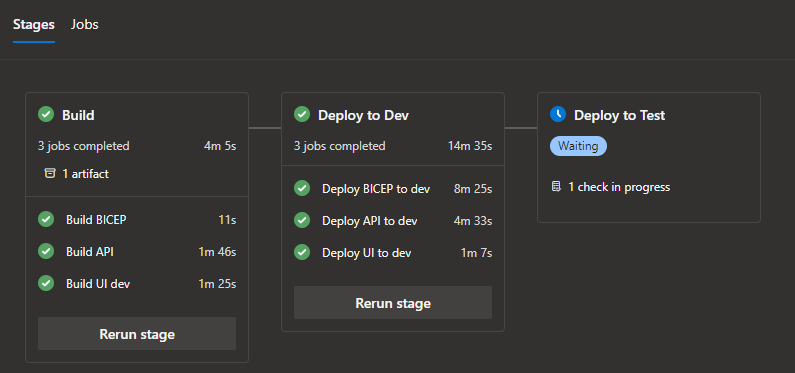
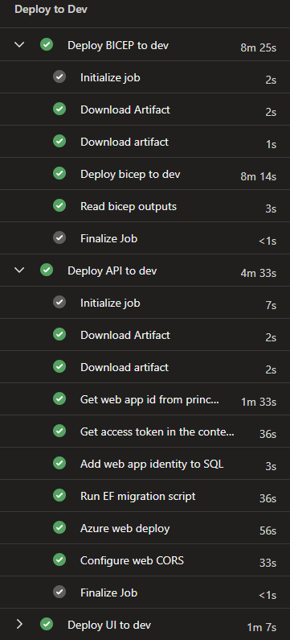
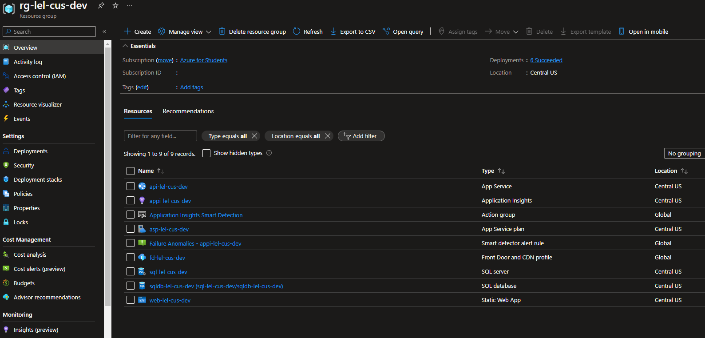

# LEL Resume project 
----

# Introduction

Build a simple Azure project that integrates front, back, database, created and configured by Bicep Template to **reduce the manual configuration**.

# Projects

It is divided in the same repo by folders.

* back: .NET project with minimal API that consume data from a SQL database
* front: React project with NextJS to show data from API
* pipelines: Biceps script to create all resources needed and Pipelines for CI-CD

# Technologies

* .NET 8
* DDD
* CQRS
* Minimal API
* Entity Framework
* Code First
* NextJS
* CI-CD
* Azure Biceps scripts
* Azure Pipelines

# Requirements

* Azure Subscription
    * AAD Group (for all devs and principals)
* Azure DevOps project
    * Service connection
    * Environments
    * Library
    * [Replace tokens extension](https://marketplace.visualstudio.com/items?itemName=qetza.replacetokens)
* Create Pipeline using `azure-pipelines.yml` 
    * Add Pipeline variables
        * azureResourceManagerConnection
        * azureSubscriptionId

# Goals

* Learn CI-CD how to deploy Azure resources using Bicep Template and deploy API and UI code by Pipelines.
* Reduce manual configuration like connection string, urls by environments, permissions...
* Bicep scrips along with Pipeline will create all Azure resources and make the configuration in steps.
    * Create or update resources (App Service, App Service plan, Application Insights, SQL server, SQL database, Static Web App, Front Door and CDN profile).
    * Add AAD Group as SQL administrator
    * Add App Service (API) Identity to SQL permissons to use `Active Directory Default` Connection string.
    * Add Connection string to API configuration.
    * Add CORS Url.
    * Create database, tables and migrations.
    * Configure custom domain

# Result

Pipeline

Pipeline steps

Azure

Front Door endpoint

https://lel-dev-fbe6e0g4ame3cngq.z02.azurefd.net/

Custom domain

https://leldev.online/
